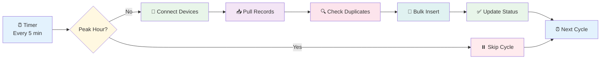

# ⚙️ ZKAttendance Service


## 📖 Overview

Background Windows Service that automatically connects to ZKTeco biometric devices, pulls attendance records, and stores them in SQL Server. Runs continuously with intelligent peak-hour management and bulk processing capabilities.

### 🎯 Key Features

- 🔌 Auto-connects to ZKTeco devices via TCP/IP every 5 minutes
- 📥 Bulk insert operations (10,000 records/batch)
- ⏸️ Smart scheduling - pauses during peak hours (check-in/check-out)
- 🔄 Retry logic with 3 automatic attempts
- 🎯 Incremental sync - only new records (last 365 days)
- 🔑 Duplicate prevention using UniqueHash algorithm

---

## 🏗️ System Architecture



**Sync Process Flow:**
```
⏰ Timer → Check Peak Hour → Connect Devices (5 parallel)
   ↓
📥 Pull Records → Calculate UniqueHash → Filter New Records
   ↓
💾 Bulk Insert (10k/batch) → Update Status → Log Results
```

> **Note:** Works with [ZKAttendanceWeb](https://github.com/Faisal-Sahli/ZKAttendanceWeb) for complete attendance management.

---

## 🛠️ Technology Stack

**Core:** .NET 8.0 Worker Service • C# 12 • Entity Framework Core

**Device:** zkemkeeper.dll (ZKTeco SDK) • TCP/IP Protocol

**Database:** SQL Server 2019+ • EFCore.BulkExtensions

**Architecture:** Dependency Injection • Service Layer • Repository Pattern

---

## 📁 Project Structure

```
ZKAttendanceService/
├── 📂 Configuration/            # ⚙️ Configuration Classes
│   ├── BranchConfiguration.cs       # Branch settings
│   ├── DeviceConfiguration.cs       # Device settings
│   ├── SyncConfiguration.cs         # Sync timing & behavior
│   └── WebApiSettings.cs            # API integration settings
│
├── 📂 Data/                     # 💾 Database Context
│   ├── ZKAttendanceWebDbContext.cs  # EF Core DbContext
│   └── Migrations/                   # Database migrations
│
├── 📂 Models/                   # 📊 Domain Entities
│   ├── AttendanceLog.cs             # Attendance records
│   ├── Branch.cs                    # Branch/location info
│   ├── Department.cs                # Department data
│   ├── Device.cs                    # Biometric device info
│   ├── DeviceError.cs               # Device error logs
│   ├── DeviceStatus.cs              # Device health status
│   ├── Employee.cs                  # Employee information
│   ├── Holiday.cs                   # Holiday calendar
│   ├── SyncLog.cs                   # Sync operation logs
│   ├── SystemSetting.cs             # System settings
│   └── WorkShift.cs                 # Work shift definitions
│
├── 📂 Services/                 # 🔧 Business Logic Layer
│   ├── ConfigurationService.cs      # Config management
│   ├── IConfigurationService.cs     # Config interface
│   ├── ISyncService.cs              # Sync interface
│   ├── IWebApiService.cs            # API interface
│   ├── IZKDeviceService.cs          # Device interface
│   ├── PeakHourService.cs           # Peak hour logic
│   ├── SyncService.cs               # Main sync operations
│   ├── WebApiService.cs             # Central server sync
│   └── ZKDeviceService.cs           # ZKTeco device communication
│
├── 📂 ZKTecoSDK/                # 📦 ZKTeco SDK Files
│   └── zkemkeeper.dll               # ZKTeco COM component
│
├── 📄 appsettings.json          # ⚙️ Configuration File
├── 📄 Program.cs                # 🚀 Application Entry Point
└── 📄 Worker.cs                 # ⏰ Background Service Worker
```


## 🚀 Getting Started

### Prerequisites

- **.NET SDK 8.0+**
- **SQL Server 2019+**
- **ZKTeco SDK** (zkemkeeper.dll)
- **Windows 10/Server 2019+**
- **ZKTeco Devices**

### Installation

1. **Clone repository**
```bash
git clone https://github.com/Faisal-Sahli/ZKAttendanceService.git
cd ZKAttendanceService
```

2. **Register ZKTeco SDK**
```bash
regsvr32 "C:\Path\To\zkemkeeper.dll"
```

3. **Configure settings in `appsettings.json`**
```json
{
  "ConnectionStrings": {
    "DefaultConnection": "Server=YOUR_SERVER;Database=ZKAttendance;Trusted_Connection=True;TrustServerCertificate=True;"
  },
  "DeviceConfiguration": {
    "Devices": [
      {
        "DeviceName": "Main Entrance",
        "DeviceIP": "192.168.1.201",
        "DevicePort": 4370,
        "IsActive": true
      }
    ]
  },
  "SyncConfiguration": {
    "EnableAutoSync": true,
    "SyncIntervalMinutes": 5,
    "SyncLastNDays": 365,
    "MaxRetryAttempts": 3,
    "PeakHours": [
      {
        "Name": "Morning Check-in",
        "StartTime": "07:00",
        "EndTime": "09:00",
        "RunImmediatelyAfter": true
      }
    ]
  }
}
```

4. **Apply migrations**
```bash
dotnet restore
dotnet ef database update
```

5. **Run as console (development)**
```bash
dotnet run
```

6. **Install as Windows Service (production)**
```bash
sc create "ZKAttendanceService" binPath="C:\Path\To\ZKAttendanceService.exe"
sc start "ZKAttendanceService"
```

---

## 🔧 Configuration

### Sync Settings

| Setting | Default | Description |
|---------|---------|-------------|
| `EnableAutoSync` | true | Enable/disable auto-sync |
| `SyncIntervalMinutes` | 5 | Frequency in minutes |
| `SyncLastNDays` | 365 | Pull records from last N days |
| `MaxRetryAttempts` | 3 | Retry count on failure |

### Peak Hours

Configure times when device usage is high to avoid overload:

```json
{
  "Name": "Morning Check-in",
  "StartTime": "07:00",
  "EndTime": "09:00",
  "RunImmediatelyAfter": true
}
```

---

## 🔄 How It Works

### Sync Cycle
```
1. Timer triggers every 5 minutes
2. Check if current time is in peak hours
   └─ YES → Skip cycle
   └─ NO  → Continue
3. Connect to devices (5 parallel connections)
4. Pull all records using ZKTeco SDK
5. Calculate UniqueHash: {UserId}{DeviceId}{DateTime}
6. Query existing hashes from database
7. Filter only new records
8. Bulk insert (10,000 records/batch)
9. Update device status and create sync log
10. Wait for next cycle
```

### Retry Logic
```
Attempt 1: Immediate
   ↓ Fail → Wait 2 seconds
Attempt 2: After 2 seconds
   ↓ Fail → Wait 4 seconds
Attempt 3: After 4 seconds
   ↓ Fail → Log error and skip
```

---

## ⚡ Performance

| Metric | Value |
|--------|-------|
| **Sync Speed** | 1,000-5,000 records/second |
| **Bulk Insert** | 10,000 records/batch |
| **Parallel Devices** | 5 simultaneous |
| **Memory Usage** | ~100-200 MB |
| **CPU Usage** | 5-15% during sync |

**Optimization Tips:**
- Add database indexes on `UniqueHash` and `AttendanceTime`
- Adjust batch size in `SyncService.cs`
- Configure connection pooling
- Balance sync interval with system load

---

## 🐛 Troubleshooting

**Service fails to start**
- Register zkemkeeper.dll: `regsvr32 zkemkeeper.dll`
- Verify .NET 8.0 Runtime is installed
- Check Windows Event Viewer

**Cannot connect to device**
- Verify IP and port (default: 4370)
- Test connectivity: `ping 192.168.x.x`
- Check firewall allows port 4370

**Duplicate records**
- Verify UniqueHash calculation
- Add index: `CREATE INDEX IX_UniqueHash ON AttendanceLogs(UniqueHash)`
- Review SyncLogs table

**Slow performance**
- Increase batch size in SyncService
- Add database indexes
- Reduce `SyncLastNDays` if not needed

---

## 📊 Database Schema

### Main Tables

| Table | Description |
|-------|-------------|
| **AttendanceLogs** | Employee attendance records |
| **SyncLogs** | Sync operation history |
| **DeviceStatuses** | Device health snapshots |
| **Devices** | Device configurations |

### AttendanceLogs Structure
```sql
CREATE TABLE AttendanceLogs (
    AttendanceId INT PRIMARY KEY IDENTITY,
    BiometricUserId NVARCHAR(50) NOT NULL,
    AttendanceTime DATETIME2 NOT NULL,
    DeviceId INT NOT NULL,
    UniqueHash NVARCHAR(100) NOT NULL UNIQUE,
    CreatedDate DATETIME2 DEFAULT GETDATE()
);

CREATE INDEX IX_UniqueHash ON AttendanceLogs(UniqueHash);
CREATE INDEX IX_AttendanceTime ON AttendanceLogs(AttendanceTime DESC);
```

---

## 🎯 Roadmap

### ✅ Phase 1 - Current
- [x] Auto-sync with retry logic
- [x] Bulk operations & peak hour management
- [x] Incremental sync & duplicate prevention

### 🔄 Phase 2 - Planned
- [ ] Real-time push notifications from devices
- [ ] Multi-branch support
- [ ] Monitoring dashboard
- [ ] Email alerts on failures

### 🔮 Phase 3 - Future
- [ ] Cloud deployment (Azure)
- [ ] Mobile app integration
- [ ] AI anomaly detection
- [ ] Predictive analytics

---

## 🤝 Contributing

Contributions welcome! Please:
1. Fork the repository
2. Create feature branch (`feature/AmazingFeature`)
3. Write tests and documentation
4. Submit pull request

**Standards:** C# conventions, XML documentation, unit tests, meaningful commits

---

## 📝 License

MIT License - Copyright (c) 2025 Faisal-Sahli

---

## 👤 Author

**Faisal Al-Sahli** - Computer Programmer @ Al-Amal Advanced Medical Company

[](https://github.com/Faisal-Sahli)
[](https://linkedin.com/in/faisal-sahli-a449281b2)

🇸🇦 Riyadh, Saudi Arabia • 2+ years ASP.NET Core • Biometric Systems Specialist

---

## 🔗 Related Projects

- **[ZKAttendanceWeb](https://github.com/Faisal-Sahli/ZKAttendanceWeb)** - Web interface for viewing data
- **[HRLink System](https://github.com/Faisal-Sahli/Faisal-Sahli_HRLink)** - Complete HR management

---

<div align="center">

### ⚙️ Automated Biometric Attendance Collection


**⭐ Star this repo if you find it useful!**

[Report Bug](https://github.com/Faisal-Sahli/ZKAttendanceService/issues) • [Request Feature](https://github.com/Faisal-Sahli/ZKAttendanceService/discussions)

Made with ❤️ by [Faisal-Sahli](https://github.com/Faisal-Sahli)

</div>
